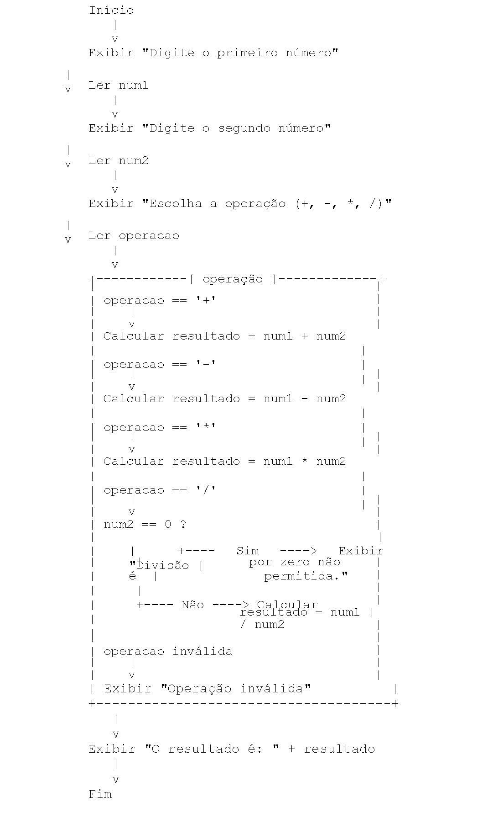
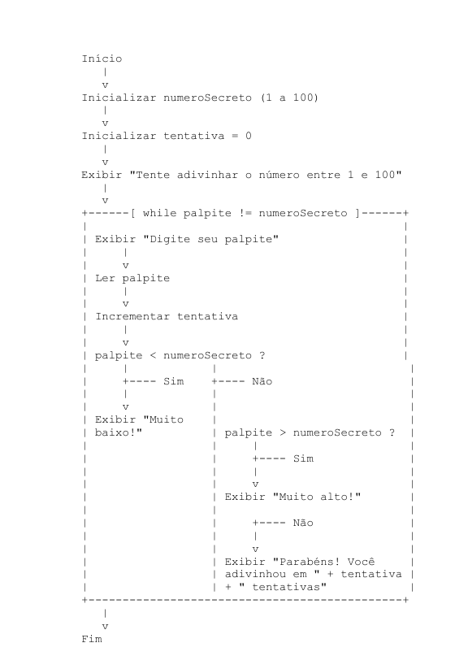

## Nos exercícios abaixo, podem usar apenas o método main e a saída padrão para resolvê-los.

```
Ex.:

public class Exercicio {

`	`public static void main(String[] args) {

`		`System.out.println("Hello World");

`	`}

}
```


### Para os exercícios abaixo, Utilizando como base a sequência lógica fornecida, implemente o programa Java:

1. Calculadora



2. adivinhação

